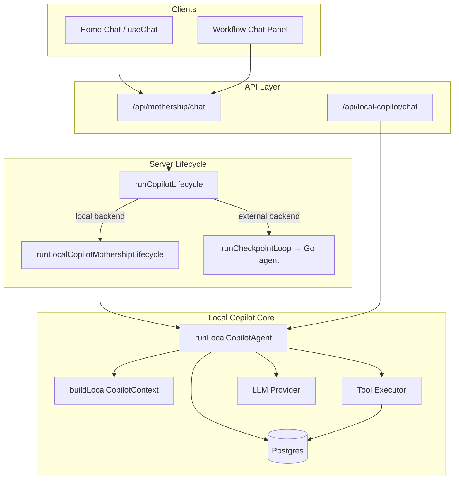

# Local Copilot (Arena Copilot)

Local Copilot is Sim’s **in-process, self-hosted AI assistant** for building, editing, debugging, and explaining workflows. When enabled, the Arena app runs the agent inside Next.js and calls your configured LLM provider directly—no traffic is relayed through Arena Cloud or the remote Mothership Go backend (`copilot.sim.ai`).

All implementation code lives under `apps/sim/local-copilot/`. HTTP routes live under `apps/sim/app/api/local-copilot/`. The existing Mothership copilot stack is unchanged; Local Copilot is an alternate backend selected at runtime via environment configuration.

---

## Table of Contents

- [Overview](#overview)
- [Capabilities](#capabilities)
- [How Routing Works](#how-routing-works)
- [Architecture](#architecture)
- [Configuration](#configuration)
- [Context & Token Budget](#context--token-budget)
- [Database & Persistence](#database--persistence)
- [API Reference](#api-reference)
- [Agent Tools](#agent-tools)
- [Workflow Creation Flow](#workflow-creation-flow)
- [Patch Confirmation Flow](#patch-confirmation-flow)
- [UI Integration](#ui-integration)
- [Security](#security)
- [Troubleshooting](#troubleshooting)
- [Development](#development)

---

## Overview

Local Copilot provides Mothership-equivalent workflow assistance for self-hosted and air-gapped deployments:

| Concern | Local Copilot | Remote Mothership |
|--------|---------------|-------------------|
| LLM calls | Your provider (Anthropic, OpenAI-compatible, etc.) | Arena Go agent at `SIM_AGENT_API_URL` |
| Tool execution | In-process via existing Arena copilot server tools | Arena executor + Go orchestration |
| Home workspace chat | `/api/mothership/chat` → in-process lifecycle bridge | `/api/mothership/chat` → Go checkpoint loop |
| Workflow editor chat | Same Mothership chat UI + Local / Cloud switch | Existing Mothership panel UI |
| Workflow data | Stays in your Postgres deployment | Same |

Enable or disable the feature with a single flag. When disabled, Arena falls back to the remote Mothership backend unchanged.

---

## Capabilities

- **Natural-language workflow assistance** — explain, debug, and modify workflows from chat.
- **Workflow-aware context** — blocks, edges, variables, credential metadata (never secrets), and recent execution logs.
- **Workspace home chat** — create workflows from scratch via `create_workflow` + `edit_workflow`, matching Mothership behavior.
- **Diff-based patches** — proposed changes require explicit user confirmation before apply.
- **SSE streaming** — token and tool-call events streamed to the client in real time.
- **Tool-calling agent** — up to 20 tool rounds per turn (`MAX_TOOL_ITERATIONS`).
- **Context budget** — workflow trimming and chat-history compression to stay within model limits (see [Context & Token Budget](#context--token-budget)).
- **Audit trail** — conversations, messages, tool calls, patches, and audit logs persisted to Postgres (standalone `/api/local-copilot/chat` path).

---

## How Routing Works

Routing is controlled by `COPILOT_ENABLED` (defaults to **`true`** when unset) and the per-user DB allowlist (`local_copilot_user_access`).

### When `COPILOT_ENABLED=true`

Routing also requires a row in `local_copilot_user_access` with `has_access = true` for the signed-in user — only allowlisted users use local copilot.

```
Home chat (workspace landing)
  POST /api/mothership/chat
    → runCopilotLifecycle()
    → shouldRouteToLocalCopilot() === true
    → runLocalCopilotMothershipLifecycle()   // in-process; Mothership-compatible SSE
    → prior turns loaded from copilot_messages

Workflow editor (Chat tab)
  WorkflowCopilotShell → MothershipChat (same UI as home)
    → POST /api/mothership/chat
    → same local routing when copilotBackend=local
```

### When `COPILOT_ENABLED=false`

```
Home chat
  POST /api/mothership/chat
    → runCheckpointLoop()
    → Go backend (SIM_AGENT_API_URL / copilot.sim.ai)

Workflow editor
  WorkflowCopilotShell → MothershipChat
    → copilotBackend=external (or user not on allowlist)
    → remote Mothership via runCheckpointLoop
```

The client does not need separate wiring for home chat: the server-side lifecycle switch is transparent to `useChat`.

---

## Architecture



### Module layout

```
apps/sim/local-copilot/
├── contracts/              # HTTP boundary schemas (Zod + defineRouteContract)
├── integration/
│   ├── mothership-lifecycle.ts   # Home chat bridge (Mothership SSE events)
│   └── workflow-copilot-shell.tsx # Thin wrapper around shared Mothership chat UI
├── lib/
│   ├── agent/              # LLM orchestration loop + system prompt
│   ├── audit/              # Audit log helper
│   ├── context/            # Workspace + workflow context builder + token budget
│   ├── patches/            # Generate, validate, apply workflow patches
│   ├── persistence/        # Drizzle store (conversations, messages, tools, patches, audit)
│   ├── providers/          # Anthropic + OpenAI-compatible streaming
│   ├── security/           # Secret sanitization for prompts
│   └── tools/              # Tool definitions, executor, workflow mutations
├── hooks/                  # useLocalCopilot, useLocalCopilotConfig
├── components/             # Panel, chat UI, patch preview
└── index.ts                # Public exports
```

---

## Configuration

Add these variables to `.env` (root or `apps/sim/.env`):

| Variable | Required | Default | Description |
|----------|----------|---------|-------------|
| `COPILOT_ENABLED` | No | `true` | Enable in-process Local Copilot. Set `false` to use remote Mothership. |
| `COPILOT_PROVIDER` | No | `anthropic` | `anthropic`, `openai`, `azure-openai`, `bedrock`, `gemini`, or `openai-compatible` |
| `COPILOT_MODEL` | No | `claude-sonnet-4-6` | Model ID registered in `@/providers/models` |
| `COPILOT_API_KEY` | Conditional | — | Preferred API key for the copilot provider |
| `ANTHROPIC_API_KEY` | Conditional | — | Used when `COPILOT_PROVIDER=anthropic` and `COPILOT_API_KEY` is unset |
| `COPILOT_BASE_URL` | No | provider default | Override base URL (required for `openai-compatible`) |

When `COPILOT_PROVIDER=anthropic`, Local Copilot sends Anthropic `cache_control` on the last tool definition and the static system prompt block (plus top-level automatic caching). Verify hits via `Arena Copilot model round finished` logs: look for `cacheReadTokens` / `cacheCreationTokens`.

### User allowlist (database)

Arena Copilot is **deny-by-default**. A user gets local copilot only when `COPILOT_ENABLED=true` **and** they have a row in `local_copilot_user_access` with `has_access = true`.

Every new signup automatically gets a `local_copilot_user_access` row (`has_access = false`) via a Postgres trigger on `"user"` insert. Migration `0250` also backfills existing users. Grant or revoke access by flipping the flag:

```sql
-- Grant access
UPDATE local_copilot_user_access
SET has_access = true, updated_at = now()
WHERE email = 'alice@yourcompany.com';

-- Or by user id
UPDATE local_copilot_user_access
SET has_access = true, updated_at = now()
WHERE user_id = '<user-id>';

-- Revoke
UPDATE local_copilot_user_access
SET has_access = false, updated_at = now()
WHERE user_id = '<user-id>';
```

| User | Backend |
|------|---------|
| Row with `has_access = true` | Local copilot (in-process) |
| No row, or `has_access = false` | External Mothership (`copilot.sim.ai`) |

The workflow editor and home chat read per-user access from `GET /api/local-copilot/config` (`canSwitchBackend` controls whether the Local / Cloud switch is shown).

On **home chat** and the **workflow editor chat tab**, allowlisted users see a **Local / Cloud** switch in the chat input toolbar (left side, next to attach/skills). The choice is saved in `localStorage` (`arena-copilot-backend-preference`) and sent with each message as `copilotBackend`.

### Example: Anthropic (recommended)

```bash
COPILOT_ENABLED=true
COPILOT_PROVIDER=anthropic
COPILOT_MODEL=claude-sonnet-4-6
ANTHROPIC_API_KEY=sk-ant-...
```

### Example: OpenAI-compatible endpoint

```bash
COPILOT_ENABLED=true
COPILOT_PROVIDER=openai-compatible
COPILOT_MODEL=your-model-id
COPILOT_BASE_URL=https://your-gateway/v1
COPILOT_API_KEY=your-key
```

### Verify configuration

```bash
curl -s http://localhost:3000/api/local-copilot/config \
  -H "Cookie: <session>"
```

Expected response:

```json
{
  "enabled": true,
  "canSwitchBackend": true,
  "provider": "anthropic",
  "model": "claude-sonnet-4-6",
  "selfHosted": true
}
```

---

## Context & Token Budget

Claude (and other providers) are **stateless** — Local Copilot rebuilds the full prompt on every user message. There is no server-side model memory; conversation continuity comes from Postgres (`copilot_messages` for Mothership/home chat, or `local_copilot_messages` for the standalone API).

Budget logic lives in `lib/context/context-budget.ts` and runs inside `runLocalCopilotAgent` before each LLM call.

### What is sent each turn

| Layer | Source | Notes |
|-------|--------|-------|
| System rules | Fixed system prompt | Copilot behavior instructions |
| Structured context | `buildLocalCopilotContext()` | Workspace, workflow, logs, integrations — rebuilt fresh every turn |
| Chat history | `copilot_messages` (Mothership path) or `local_copilot_messages` | Prior user/assistant turns |
| Current message | Request body | Latest user input |
| Tool rounds | In-memory `messages` array | Assistant + tool results appended within the same turn (up to 20 rounds) |

### Default limits

| Constant | Default | Purpose |
|----------|---------|---------|
| `LOCAL_COPILOT_PROMPT_TOKEN_BUDGET` | `120_000` | Max estimated input tokens for the full prompt |
| `LOCAL_COPILOT_WORKFLOW_FULL_STATE_TOKEN_BUDGET` | `24_000` | Above this, workflow is sent in **compact** mode |
| `LOCAL_COPILOT_RECENT_TURNS_FULL` | `6` | Recent turns kept verbatim in history |
| `LOCAL_COPILOT_MAX_HISTORY_MESSAGES` | `50` | Hard cap on prior chat rows loaded |
| `LOCAL_COPILOT_MAX_MESSAGE_CHARS` | `8_000` | Per-message truncation in recent history |

Token estimation uses js-tiktoken via `getAccurateTokenCount` (`@/lib/tokenization/estimators`), keyed to the configured `COPILOT_MODEL`. Unknown model encodings fall back to `gpt-4` / `cl100k_base` inside the tokenizer helper.

### Workflow context: full vs compact

When the serialized workflow JSON exceeds **24k estimated tokens**, context switches to **compact** mode:

| Field | Full mode | Compact mode |
|-------|-----------|--------------|
| Blocks | Full `subBlocks` + values | `id`, `type`, `name`, `enabled`, `subBlockKeys` only |
| Selected block | Full detail | Full `subBlocks` for `selectedBlockId` when set |
| Edges | Full | `id`, `source`, `target`, handles |
| Variables | Full values | `id`, `name`, `type` per variable |
| Loops / parallels | Full | Included |

Compact payloads include `detail: "compact"` and a note directing the model to use `edit_workflow` for full parameters.

### Chat history compression

1. Load up to **50** prior messages from the chat transcript.
2. Keep the last **6 turns** (user + assistant groups) verbatim.
3. **Older turns** collapse into one system message:

   ```
   Earlier conversation (compressed summary of N prior turns):
   Turn 1:
   - User: ...
   - Assistant: ...
   ```

4. Truncate any single recent message longer than **8k characters**.
5. If the assembled prompt still exceeds **120k estimated tokens**, drop the oldest conversational messages until it fits.

### Mothership vs standalone persistence

| Path | History source | Local copilot DB writes |
|------|----------------|-------------------------|
| Home / workflow chat (`copilotBackend=local`) | `copilot_messages` via `loadMothershipChatHistoryForLocalCopilot` | Skipped (`persistLocally: false`) — Mothership tables own the transcript |
| `POST /api/local-copilot/chat` | `local_copilot_messages` | Full persistence (conversation, messages, tool calls, patches) |

### Observability

Each agent turn logs budget decisions:

```
[INFO] Loaded mothership chat history for Arena Copilot { chatId, turns: 12 }
[INFO] Arena Copilot prompt budget applied { workflowDetail: 'compact', historyTurns: 7, estimatedPromptTokens: 45230 }
```

If you hit provider context errors despite budgeting, reduce workflow size, shorten chat threads, or lower the constants in `context-budget.ts`.

## Database & Persistence

Local Copilot persists chat and audit data to Postgres. Apply the migration before first use:

```bash
cd packages/db && bun run db:migrate
```

Migration files: `packages/db/migrations/0248_local_copilot.sql`, `packages/db/migrations/0249_local_copilot_user_access.sql`, `packages/db/migrations/0250_local_copilot_user_access_trigger.sql`

### Tables

| Table | Purpose |
|-------|---------|
| `local_copilot_conversations` | One row per copilot session (user, workspace, optional workflow) |
| `local_copilot_messages` | User and assistant messages (JSON content, sequenced) |
| `local_copilot_tool_calls` | Tool name, arguments, and result per call |
| `local_copilot_patches` | Proposed workflow patches (`pending` → `applied` / `rejected` / `expired`) |
| `local_copilot_audit_logs` | Action audit trail (chat messages, patch apply/reject, etc.) |
| `local_copilot_user_access` | Per-user allowlist (`user_id`, `email`, `has_access`). New users get a row automatically (`has_access = false`) via trigger on `"user"` insert. |

### What gets written per chat turn

**Standalone API** (`POST /api/local-copilot/chat`, `persistLocally: true`):

1. **Conversation** — created if no `conversationId` is supplied.
2. **User message** — appended before the LLM call.
3. **Audit log** — one `chat_message` entry per user turn.
4. **Tool calls** — one row per tool invocation (`create_workflow`, `edit_workflow`, etc.).
5. **Assistant message** — appended after the turn completes.
6. **Patch** — saved when a patch result is returned and a `workflowId` is set.

**Mothership / home chat bridge** (`runLocalCopilotMothershipLifecycle`, `persistLocally: false`):

- Transcript is stored in **`copilot_messages`** (same as Cloud mode UI history).
- Prior turns are loaded from that table and passed to the agent as `priorMessages`.
- Local copilot tables are **not** written for each home-chat turn (no duplicate conversation rows).

The dedicated `POST /api/local-copilot/chat` route remains available for standalone drawer/panel integrations that want Local Copilot–native persistence.

### Verify persistence

```sql
SELECT COUNT(*) FROM local_copilot_conversations;
SELECT COUNT(*) FROM local_copilot_messages;
SELECT COUNT(*) FROM local_copilot_tool_calls;
SELECT COUNT(*) FROM local_copilot_audit_logs;
```

If inserts fail with `relation "local_copilot_conversations" does not exist`, run the migration above.

---

## API Reference

All routes require an authenticated session and workspace access where applicable.

| Method | Path | Description |
|--------|------|-------------|
| `GET` | `/api/local-copilot/config` | Provider, enabled status, and `canSwitchBackend` for the signed-in user |
| `POST` | `/api/local-copilot/chat` | SSE streaming chat (workflow editor) |
| `GET` | `/api/local-copilot/conversations` | List conversations for a workspace |
| `GET` | `/api/local-copilot/conversations/:conversationId` | Conversation detail + messages |
| `GET` | `/api/local-copilot/patches/:patchId` | Patch detail and status |
| `POST` | `/api/local-copilot/patches/:patchId/apply` | Validate and apply a pending patch |
| `POST` | `/api/local-copilot/patches/:patchId/reject` | Reject a pending patch |

Contracts: `apps/sim/local-copilot/contracts/local-copilot.ts`

### Chat request body

```json
{
  "workspaceId": "uuid",
  "workflowId": "uuid",
  "message": "Explain why this workflow failed",
  "conversationId": "optional-uuid",
  "selectedBlockId": "optional-block-id",
  "executionId": "optional-execution-id"
}
```

### SSE event types

| Event | Description |
|-------|-------------|
| `text_delta` | Streaming assistant text |
| `tool_call_start` | Tool invocation began |
| `tool_call_result` | Tool completed (success or error) |
| `patch_proposed` | Workflow patch awaiting confirmation |
| `recommendations` | Suggested follow-up actions |
| `error` | Terminal error |
| `done` | Turn complete (includes `messageId`) |

---

## Agent Tools

| Tool | Purpose |
|------|---------|
| `create_workflow` | Create an empty workflow in the workspace (home chat) |
| `edit_workflow` | Apply block/edge operations (add, edit, delete, subflow ops) |
| `get_workflow_context` | Return structured workflow + execution context |
| `get_available_blocks` | List block types (optional category filter) |
| `get_available_integrations` | List integration categories |
| `validate_workflow` | Structural validation of current workflow |
| `generate_workflow_patch` | Generate a diff patch plan (does not apply) |
| `propose_workflow_patch` | Submit a patch for user confirmation |
| `get_execution_logs` | Fetch recent execution logs for debugging |
| `explain_error` | Analyze an error with workflow context |
| `search_docs` | Search block/integration documentation |
| `load_user_skill` | Load full instructions for a user-created workspace skill (only registered when the workspace has skills) |
| `create_workflow` / `edit_workflow` reuse the same server implementations as Mothership (`executeCreateWorkflow`, `editWorkflowServerTool`).

In addition, 70 Mothership server tools are delegated in-process (`lib/tools/mothership-delegated-tool-defs.ts`), grouped as:

| Group | Tools |
|-------|-------|
| Run & logs | `run_workflow`, `run_workflow_until_block`, `get_workflow_run_options`, `query_logs`, `get_workflow_data` |
| Workflow management | `rename_workflow`, `move_workflow`, `delete_workflow`, `manage_folder`, `get_block_upstream_references`, `set_block_enabled`, `set_global_workflow_variables`, `get_deployed_workflow_state`, `list_user_workspaces` |
| Deployment | `deploy_chat`, `deploy_api`, `deploy_mcp`, `redeploy`, `load_deployment`, `promote_to_live`, `update_deployment_version`, `get_deployment_log`, `check_deployment_status`, `diff_workflows`, `get_block_outputs` |
| MCP servers | `list_workspace_mcp_servers`, `create_workspace_mcp_server`, `update_workspace_mcp_server`, `delete_workspace_mcp_server` |
| Scheduled tasks | `manage_scheduled_task`, `complete_scheduled_task`, `update_scheduled_task_history`, `get_scheduled_task_logs` |
| Credentials & OAuth | `manage_credential`, `oauth_get_auth_link`, `oauth_request_access`, `generate_api_key` |
| Skills & custom tools | `manage_skill`, `manage_custom_tool`, `manage_mcp_tool`, `search_documentation`, `get_platform_actions` |
| Files & VFS | `read`, `glob`, `grep`, `create_file`, `create_file_folder`, `rename_file`, `move_file`, `delete_file`, `list_file_folders`, `rename_file_folder`, `move_file_folder`, `delete_file_folder`, `workspace_file`, `download_to_workspace_file`, `materialize_file`, `open_resource`, `edit_content`, `restore_resource` |
| Data & knowledge | `user_table`, `knowledge_base`, `enrichment_run`, `list_integration_tools` |
| Media & compute | `generate_image`, `generate_audio`, `generate_video`, `ffmpeg`, `search_online`, `function_execute` |

Destructive tools (`delete_workflow`, `delete_file`, `delete_workspace_mcp_server`, `manage_credential` delete, `promote_to_live`, …) rely on the same server-side workspace permission checks as Cloud, and the system prompt requires explicit user intent before calling them. Deliberately excluded: `set_environment_variables`, `load_integration_tool` (Local uses `invoke_integration_tool`).

Tool definitions: `lib/tools/definitions.ts`. Delegated tools: `lib/tools/mothership-delegated-tool-defs.ts`. Workspace skills: `lib/tools/user-skills.ts`.

---

## Workflow Creation Flow

On workspace home chat (no workflow open), the agent follows the same pattern as Mothership:

```
1. create_workflow          → empty workflow + workflowId
2. edit_workflow            → add blocks, edges, configuration
3. edit_workflow (retry)    → fix skippedItems, validation errors, or lint issues
4. Resource panel opens     → workflow appears in chat resources (Mothership SSE bridge)
```

Implementation details:

- `create_workflow` always runs before `edit_workflow` when both are requested in one turn.
- After create, `workflowId` is propagated to subsequent tools and context is refreshed.
- Edit results include `needsFollowUpEdit` when operations were skipped or lint failed; the system prompt instructs the agent to retry.
- Up to **20 tool rounds** per user message.

---

## Patch Confirmation Flow

For in-editor changes (when a workflow is already open):

```
User request
  → Agent calls generate_workflow_patch / propose_workflow_patch
  → Patch saved with status: pending
  → UI shows diff preview (PatchPreview)
  → User clicks Apply
      → POST /api/local-copilot/patches/:id/apply
      → Validated and applied to workflow state
      → Audit log + status: applied
  → User clicks Reject
      → POST /api/local-copilot/patches/:id/reject
      → status: rejected
```

Patches always carry `requiresConfirmation: true`. The agent cannot silently mutate workflow state through the patch path.

---

## UI Integration

The workflow editor uses `WorkflowCopilotShell`, which renders the shared **Mothership chat UI** (with Local / Cloud switch in the input toolbar). Local vs Cloud routing is server-side; the shell does not swap to a separate panel component.

```tsx
import { WorkflowCopilotShell, useCopilotBackendPreference } from '@/local-copilot'
import { MothershipChat } from '@/app/workspace/[workspaceId]/home/components'

const { canSwitchBackend, copilotBackend, setCopilotBackend } = useCopilotBackendPreference()

<WorkflowCopilotShell
  workspaceId={workspaceId}
  workflowId={workflowId}
  mothershipChat={
    <MothershipChat
      layout="copilot-view"
      canSwitchCopilotBackend={canSwitchBackend}
      copilotBackend={copilotBackend}
      setCopilotBackend={setCopilotBackend}
      {...chatProps}
    />
  }
/>
```

Standalone drawer (Local Copilot–native SSE + persistence):

```tsx
import { LocalCopilotPanel } from '@/local-copilot'

<LocalCopilotPanel
  workspaceId={workspaceId}
  workflowId={workflowId}
  selectedBlockId={selectedBlockId}
  executionId={lastExecutionId}
  open={copilotOpen}
  onOpenChange={setCopilotOpen}
  onPatchApplied={() => reloadWorkflow()}
/>
```

React Query hooks: `useLocalCopilot`, `useLocalCopilotConfig`, `useLocalCopilotConversations`, `useCopilotBackendPreference`

---

## Security

- **No secret exfiltration** — prompts include credential *metadata* (provider, status, scopes) only. API keys, tokens, and env secrets are stripped via `lib/security/sanitize.ts` and workflow sanitization helpers.
- **Workspace authz** — all API routes verify session and workspace access before executing the agent.
- **Patch gate** — structural changes to open workflows require explicit user confirmation unless using the explicit `edit_workflow` tool path on home chat (same as Mothership).
- **Direct provider calls** — LLM traffic goes from your Arena deployment to your configured provider; Arena Cloud is not in the path when Local Copilot is enabled.

---

## Troubleshooting

| Symptom | Likely cause | Fix |
|---------|--------------|-----|
| 503 on `/api/local-copilot/chat` | `COPILOT_ENABLED=false` or missing API key | Set `COPILOT_ENABLED=true` and `ANTHROPIC_API_KEY` / `COPILOT_API_KEY` |
| Still hitting `copilot.sim.ai` | `COPILOT_ENABLED=false` | Set `COPILOT_ENABLED=true` and restart dev server |
| `relation "local_copilot_*" does not exist` | Migration not applied | `cd packages/db && bun run db:migrate` |
| Anthropic 400 on temperature | Model does not support temperature | Already handled via `supportsTemperature()` in the Anthropic provider |
| Workflow created but not opened | Resource side effects | Ensure home chat uses the Mothership lifecycle bridge with `copilotBackend=local` |
| Local copilot ignores earlier messages | History not loaded | Fixed: Mothership path loads `copilot_messages`; verify `chatId` is set |
| Claude context / token limit errors | Prompt too large | Check logs for `workflowDetail: 'compact'`; shorten thread or reduce workflow size |
| Local / Cloud switch not visible | `canSwitchBackend: false` | Set `COPILOT_ENABLED=true` and insert/enable a `local_copilot_user_access` row for the user |

### Logs to look for (enabled)

```
[INFO] Running Arena Copilot mothership lifecycle
[INFO] Loaded mothership chat history for Arena Copilot { chatId, turns: N }
[INFO] Arena Copilot prompt budget applied { workflowDetail, historyTurns, estimatedPromptTokens }
[INFO] Arena Copilot model round finished { inputTokens, outputTokens, cacheReadTokens, cacheCreationTokens, ... }
[INFO] Executing Arena Copilot tool { toolName: 'create_workflow' }
[INFO] Arena Copilot turn complete
```

You should **not** see `Starting stream loop` (Go checkpoint loop) when Local Copilot is active.

---

## Development

### Run tests

```bash
cd apps/sim
bunx vitest run local-copilot/
```

### Key entry points

| File | Role |
|------|------|
| `lib/agent/orchestrator.ts` | Agent loop, system prompt, tool rounds, budget application |
| `lib/context/context-budget.ts` | Token budget, history compression, workflow full/compact |
| `lib/mothership-history.ts` | Load prior turns from `copilot_messages` |
| `integration/mothership-lifecycle.ts` | Home / workflow chat SSE bridge |
| `lib/copilot/request/lifecycle/run.ts` | Enabled/disabled routing decision |
| `lib/persistence/store.ts` | All Postgres writes |

### Public exports

```ts
import {
  LocalCopilotPanel,
  WorkflowCopilotShell,
  useLocalCopilot,
  useLocalCopilotConfig,
  useCopilotBackendPreference,
  isLocalCopilotBackendActive,
  shouldRouteToLocalCopilot,
} from '@/local-copilot'
```

---

## Related Documentation

- [executive.md](./executive.md) — architecture, code logic, and production requirements (engineering leadership)
- Arena copilot server tools: `apps/sim/lib/copilot/tools/`
- Mothership lifecycle: `apps/sim/lib/copilot/request/lifecycle/run.ts`
- DB schema: `packages/db/schema.ts` (`localCopilot*` tables)
- Migration: `packages/db/migrations/0248_local_copilot.sql`
