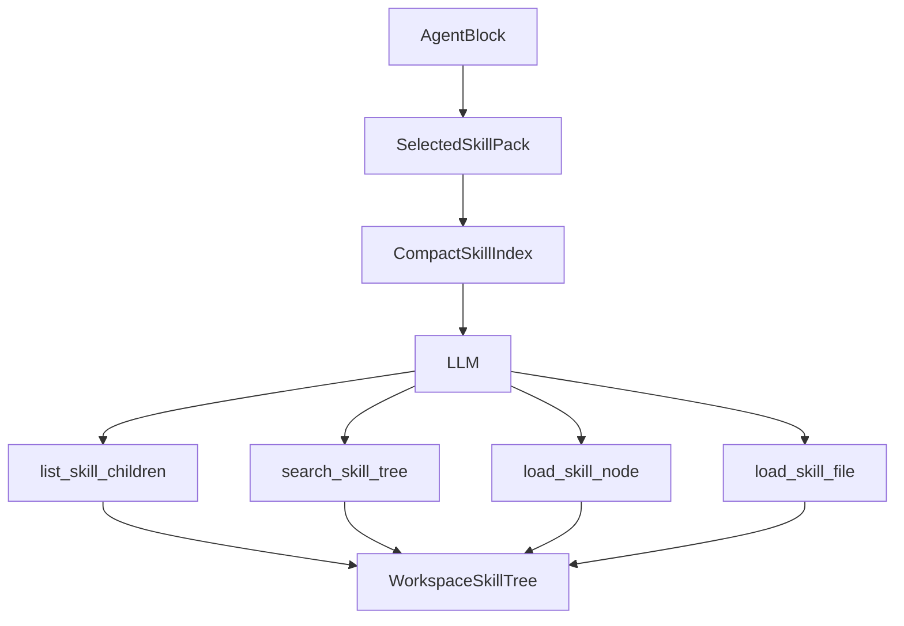

# Hierarchical Agent Skills Plan

## Goal

Extend Sim workspace skills from flat markdown blobs into hierarchical skill packs that preserve `skills.sh`-style repository layouts, support sidecar reference files, and let agent blocks discover/load only the relevant content at runtime.

This should follow the progressive-loading pattern used by agents such as jcode: expose a compact skill registry first, then let the model load a specific skill or reference file by path when needed.

References:

- jcode skill registry and `load_file` pattern: [1jehuang/jcode `skill.rs`](https://github.com/1jehuang/jcode/blob/30184260b6ff18f10f9c402dae6429cc8a4f3acc/src/skill.rs#L188)
- Multi-skill repository example: [AgriciDaniel/claude-ads skills](https://github.com/AgriciDaniel/claude-ads/tree/main/skills)
- Skill with supporting reference files: [microsoft/azure-skills airunway-aks-setup](https://github.com/microsoft/azure-skills/tree/main/skills/airunway-aks-setup)

## Current State

Sim currently supports workspace skills as flat records:

- `packages/db/schema.ts` defines `skill` with `name`, `description`, and `content`.
- `apps/sim/blocks/blocks/agent.ts` exposes a `skill-input` subblock.
- `apps/sim/executor/handlers/agent/skills-resolver.ts` injects selected skill metadata into the system prompt and builds a `load_skill` tool.
- `apps/sim/tools/index.ts` handles `load_skill` by resolving content from the flat workspace skill table.
- `apps/sim/app/api/skills/import/route.ts` supports importing one GitHub `SKILL.md` file, not a repository tree.

This already avoids filling context with full skill content, but it cannot preserve nested skill directories or load sidecar files such as `references/*.md`.

## Target Design

Represent a workspace skill as a skill pack with a tree of nodes.



Use path-aware tools so duplicate names in different folders remain unambiguous.

## Data Model

Add a normalized node table instead of storing the hierarchy inside one JSON column.

Proposed schema:

```text
skill
  id
  workspaceId
  userId
  name
  description
  content
  sourceUrl
  sourceType
  rootPath
  createdAt
  updatedAt

skill_node
  id
  skillId
  parentId
  workspaceId
  path
  type: folder | skill | file
  name
  description
  content
  allowedTools
  searchText
  sortOrder
  createdAt
  updatedAt
```

Compatibility:

- Existing flat skills become a root `skill_node` of type `skill` with path `SKILL.md`.
- Keep `skill.content` during migration for rollback/backward compatibility, but new runtime reads from nodes.
- Once migrated safely, `skill.content` can become a denormalized preview or be deprecated later.

## Import Flow

Extend import to support:

- Existing single GitHub `blob/.../SKILL.md` and raw GitHub URLs.
- GitHub tree URLs such as `/tree/main/skills`.
- Repository shorthand/source metadata from skills directories where available.

Implementation approach:

- Add a server-side importer under `apps/sim/lib/workflows/skills/importers/`.
- Parse GitHub URLs into owner, repo, ref, and subpath.
- Use GitHub tree/content APIs to discover files under the selected subpath.
- Identify every `SKILL.md`.
- Preserve all files below each skill directory as `file` nodes.
- Parse frontmatter from each `SKILL.md` into `name`, `description`, and optional `allowed-tools`.
- Apply limits: max files, max total bytes, max per-file bytes, allowed text extensions.

The API should return a preview tree first, then persist after user confirmation.

## Runtime Flow

Update `apps/sim/executor/handlers/agent/skills-resolver.ts` to resolve hierarchical metadata.

Prompt injection should include only a compact tree index:

```xml
<available_skills>
  <skill_pack id="..." name="ads">
    <node path="skills/ads-google/SKILL.md" name="ads-google">
      <description>...</description>
    </node>
  </skill_pack>
</available_skills>
```

Add or replace injected tools:

- `list_skill_children({ skill_id, path })`: returns immediate children and descriptions.
- `search_skill_tree({ skill_id, query })`: returns ranked paths using metadata/search text.
- `load_skill_node({ skill_id, path })`: returns one `SKILL.md` body and nearby file list.
- `load_skill_file({ skill_id, path })`: returns one sidecar file, constrained to the selected skill tree.

Security constraints:

- Path must resolve to a known DB node, not arbitrary storage.
- File loads must be scoped to selected skill packs.
- Enforce permissions through the existing `validateSkillsAllowed`/`assertPermissionsAllowed` path.
- Keep all tool names hidden from ordinary toolbar selection if they are only agent-injected tools.

## UI Changes

Settings skills UI:

- Replace the flat skill list in `apps/sim/app/workspace/[workspaceId]/settings/components/skills/skills.tsx` with a tree-aware view.
- Add import preview for repository/tree URLs.
- Show provenance: source URL, imported path, file count, and last imported time.
- Allow expanding a skill pack and viewing leaf `SKILL.md` and sidecar files.

Skill modal/import UI:

- Extend `apps/sim/app/workspace/[workspaceId]/settings/components/skills/components/skill-import.tsx` to accept GitHub tree URLs.
- Keep existing single-file import as a simple path.
- For tree imports, preview the hierarchy before saving.

Agent block skill selector:

- Update `apps/sim/app/workspace/[workspaceId]/w/[workflowId]/components/panel/components/editor/components/sub-block/components/skill-input/skill-input.tsx` so selected entries can reference:
  - a whole pack,
  - a folder,
  - or a leaf skill node.
- Store selections with stable IDs and paths, not only `{ skillId, name }`.

## API Changes

Extend `apps/sim/app/api/skills/route.ts`:

- `GET /api/skills?workspaceId=...` returns packs with optional shallow tree metadata.
- `POST /api/skills` can create/update flat skills and hierarchical packs.
- `DELETE /api/skills` deletes a pack and cascades nodes.

Add endpoints:

- `POST /api/skills/import/preview` returns parsed tree without saving.
- `POST /api/skills/import` persists the previewed tree.
- `GET /api/skills/[skillId]/tree` returns lazy children.
- `GET /api/skills/[skillId]/nodes/[nodeId]` returns a specific node for UI viewing/editing.

All routes must use `withRouteHandler`.

## Implementation Phases

1. Schema and migration
   - Add `skill_node` and source metadata columns.
   - Backfill one root node per existing flat skill.
   - Add repository tests around migration assumptions where practical.

2. Skill tree operations
   - Add list/get/search/load functions in `apps/sim/lib/workflows/skills/operations.ts` or a new focused module.
   - Keep flat skill APIs working through compatibility wrappers.

3. Importer
   - Build GitHub single-file and tree importers.
   - Preserve sidecar files under each skill directory.
   - Add size, path, and extension validation.

4. API
   - Add preview/persist/tree endpoints.
   - Update existing skills route response shape carefully to avoid breaking current UI.

5. Agent runtime
   - Extend `SkillInput` types in `apps/sim/executor/handlers/agent/types.ts`.
   - Replace name-only `load_skill` resolution with path-aware node loading.
   - Inject `list_skill_children`, `search_skill_tree`, `load_skill_node`, and `load_skill_file`.
   - Keep legacy `load_skill(skill_name)` for existing workflow compatibility.

6. UI
   - Update settings skill management to render packs and nodes.
   - Update import modal to preview and save tree imports.
   - Update agent skill selector and block display hydration for hierarchical selections.

7. Tests and validation
   - Unit tests for frontmatter parsing, GitHub URL parsing, path safety, tree discovery, and node search.
   - API tests for import preview/persist and permission failures.
   - Agent handler tests proving only metadata is injected initially and full content loads via tools.
   - UI-focused tests for selecting a pack/folder/leaf where existing test patterns support it.

## Compatibility Strategy

- Existing workflows with `skills: [{ skillId, name }]` continue to work.
- Existing flat skills remain editable as single-node packs.
- Existing GitHub `SKILL.md` import still fills the create form or creates a single-node pack.
- New hierarchical selections use `{ skillId, nodeId?, path?, selectionType }`.

## Risks

- GitHub import complexity: tree APIs, rate limits, large repositories, and branch/path parsing need strict limits.
- Prompt/tool design: if the model gets too little index information, it may not discover the right skill; if it gets too much, context bloat returns.
- Sidecar file safety: loading arbitrary repository files must be constrained to imported text files and stored DB nodes.
- Migration complexity: flat and hierarchical skills need to coexist until all UI/runtime paths are migrated.

## Acceptance Criteria

- A GitHub tree like `skills/` can be imported as one workspace skill pack.
- A skill directory with `SKILL.md` plus `references/` preserves all usable text files.
- Agent prompt initially includes only compact metadata for selected packs.
- Agent can list/search/load specific skill nodes and reference files during execution.
- Existing flat skills and workflows continue to run unchanged.
